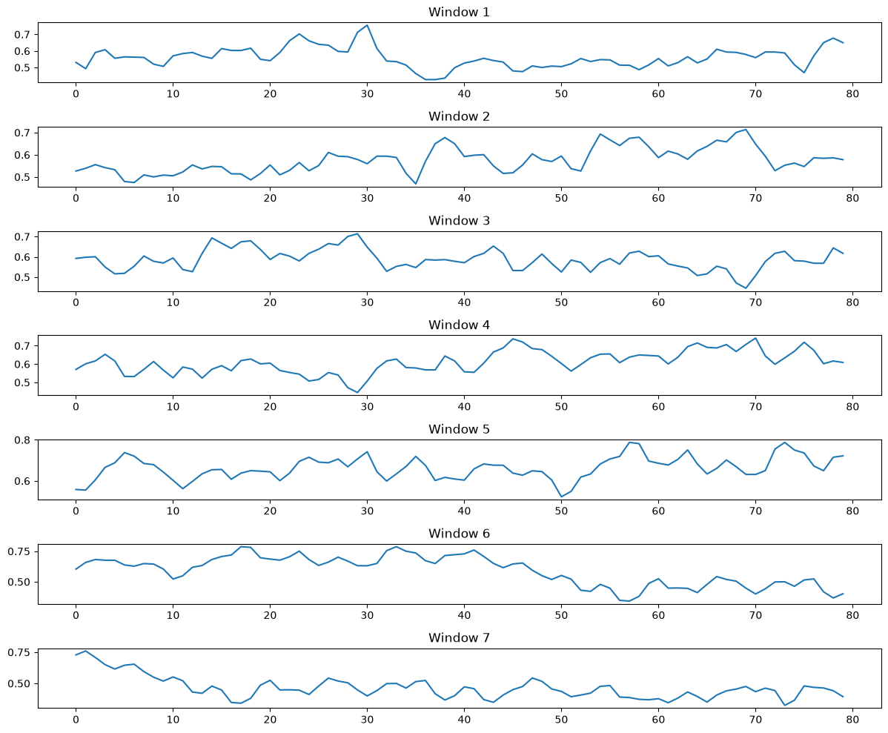
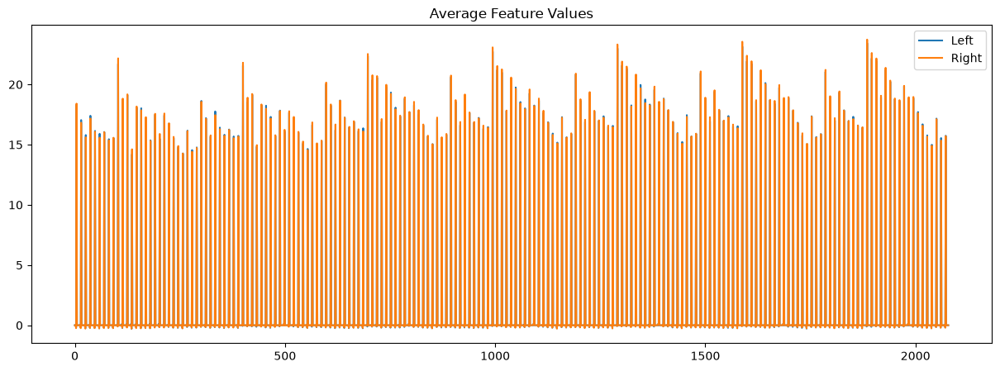
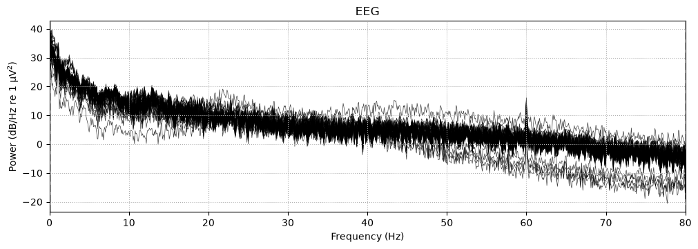
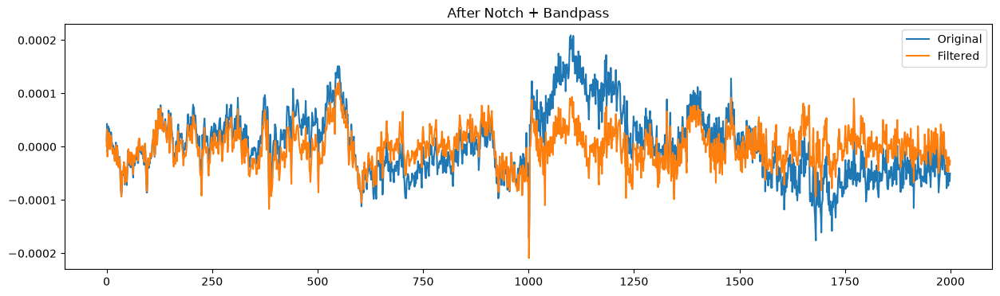
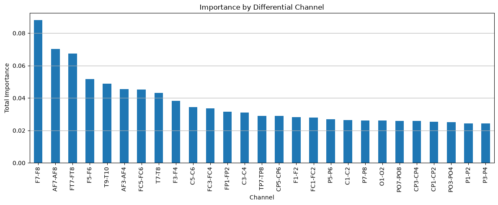

# EEG Motor Imagery Classification using Attention-Based LSTM
---

## Overview


The objective of this work is not only to reproduce the published methodology but also to investigate every stage of the pipeline, verify the reported implementation details, analyze feature importance, evaluate preprocessing strategies, and identify possible reasons for performance differences.

Unlike a simple implementation, this repository documents every experiment performed during the replication process, making it suitable for researchers, students and anyone interested in EEG signal processing and Brain-Computer Interfaces (BCIs).

---

# Problem Statement

Motor Imagery (MI) Brain-Computer Interfaces enable users to control external devices using imagined limb movements recorded through Electroencephalography (EEG).

However, EEG signals are:

- Extremely noisy
- Non-stationary
- Subject-dependent
- High-dimensional
- Difficult to generalize across subjects

Traditional machine learning methods often struggle to capture the temporal dependencies present in EEG recordings.

The original paper proposes an Attention-based Long Short-Term Memory (Attention-LSTM) architecture that uses handcrafted EEG features extracted from overlapping temporal windows to classify left- and right-hand motor imagery.

This project attempts to faithfully reproduce that methodology while thoroughly analyzing its strengths and limitations.

---

# Objectives

The primary objectives of this project are:

- Replicate the published Attention-LSTM architecture
- Implement the complete EEG preprocessing pipeline
- Reproduce handcrafted feature extraction
- Evaluate cross-subject performance
- Compare LSTM with Attention-LSTM
- Analyze feature importance
- Study the effect of preprocessing choices
- Investigate why reproduced performance differs from the published results

---

# Proposed Solution

The complete pipeline implemented in this repository follows:

Raw EDF EEG

↓

Differential Channel Construction (27 bipolar pairs)

↓

50 Hz Notch Filter

↓

0.5–70 Hz Band-pass Filter

↓

(Optional) Min-Max Normalization

↓

2-second EEG Segmentation

↓

7 Overlapping Windows

↓

11 Statistical Features per Channel

↓

297 Features per Window

↓

7-step Temporal Sequence

↓

LSTM / Attention-LSTM

↓

Left vs Right Hand Classification

---

# Dataset

Dataset Used:

**EEG Motor Movement/Imagery Dataset (PhysioNet EEGMMIDB)**

Characteristics

- 109 Subjects
- EDF Format
- 64 EEG Channels
- Sampling Rate: 160 Hz
- Multiple Motor Imagery Tasks
- Left vs Right Hand Imagery used in this project

Runs Used

- R04
- R08
- R12

Subjects Removed (as in original paper)

- S043
- S088
- S089
- S092
- S100
- S104

Final Subjects Used

103 Subjects

Total Trials

4635

---

# EEG Preprocessing Pipeline

## Step 1

Load EDF recordings using MNE-Python

---

## Step 2

Create 27 Differential Bipolar Channels

Examples

- FC5 − FC6
- C3 − C4
- P3 − P4
- O1 − O2

Total

27 Channels

---

## Step 3

Noise Removal

50 Hz Notch Filter

---

## Step 4

Band-pass Filtering

0.5–70 Hz

---

## Step 5

Normalization Experiments

Two pipelines were investigated

### Pipeline A

Min-Max Normalization

(as described in the paper)

### Pipeline B

No Normalization

(an experimental study)

---

## Step 6

Epoch Extraction

2-second motor imagery segments

320 samples

---

## Step 7

Window Generation

Each segment divided into

7 overlapping windows

Window length

80 samples

Overlap

50%

---

## Step 8

Feature Extraction

For every window

↓

27 channels

↓

11 handcrafted features

↓

297-dimensional feature vector

---

# Handcrafted Features

Time-domain Features

1. Mean
2. Variance
3. Skewness
4. Kurtosis
5. Zero Crossing Count
6. Area Under Curve
7. Peak-to-Peak Range

Frequency-domain Features

8. Delta Power

9. Theta Power

10. Alpha Power

11. Beta Power

---

# Deep Learning Models

## Model 1

Stacked LSTM

Input

7 × 297

Architecture

- LSTM
- LSTM
- LSTM
- Dense
- Sigmoid

---

## Model 2

Attention-LSTM

Architecture

- Three stacked LSTM layers
- Temporal Attention
- Dense Layer
- Output Layer

Several attention variants were implemented and evaluated during the replication process.

---

# Repository Structure

```text
EEG_LSTM_Replication/
│
├── data/
│   └── eegmmidb/
│
├── processed/
│   ├── X.npy
│   ├── y.npy
│   ├── subjects.npy
│   ├── X_no_norm.npy
│   ├── X_offset80.npy
│   └── ...
│
├── notebooks/
│
│   01_data_loading.ipynb
│   02_channel_analysis.ipynb
│   03_preprocessing.ipynb
│   04_segmentation.ipynb
│   05_window_generation.ipynb
│   06_feature_extraction.ipynb
│   ...
│   17_paper_attention_lstm.ipynb
│   18_exact_paper_lstm.ipynb
│   19_pipeline_verification.ipynb
│   20_segment_offset_experiment.ipynb
│   21_cross_subject_lstm_offset80.ipynb
│   22_feature_importance_analysis.ipynb
│   23_psd_integration_experiment.ipynb
│
├── README.md
└── requirements.txt
```
---

# Technologies Used

Programming Language

- Python

Libraries

- NumPy
- SciPy
- Pandas
- Matplotlib
- Scikit-learn
- TensorFlow
- Keras
- MNE-Python

Deep Learning

- LSTM
- Attention Mechanism

Signal Processing

- Butterworth Filtering
- Notch Filtering
- Welch PSD
- Statistical Feature Extraction

---

# Experimental Findings

Major observations obtained during replication:

- Cross-subject evaluation is substantially more challenging than subject-dependent testing.
- Removing Min-Max normalization consistently improved performance on the handcrafted feature pipeline.
- Random Forest achieved performance comparable to LSTM, suggesting that handcrafted statistical features already capture much of the discriminative information.
- Mean, skewness, kurtosis, area and range were identified as the most informative feature types.
- Frontal differential channel pairs (e.g., F7–F8, AF7–AF8, FT7–FT8) contributed the highest feature importance.
- Temporal attention produced only modest improvements over the baseline LSTM under the reproduced pipeline.
- The reproduced performance remained below the accuracy reported in the original paper, indicating possible differences in preprocessing, implementation details or evaluation protocol.

---

# Results

Approximate Cross-Subject Performance

| Model | Accuracy |
|---------|---------:|
| Random Forest | ~77% |
| Stacked LSTM | ~76–77% |
| Attention-LSTM | ~75–77% |







---

# Future Work

Potential research directions include:

- Channel-wise attention mechanisms
- Dual attention (temporal + channel attention)
- Feature-level attention
- Explainable AI for EEG interpretation
- Automatic feature selection
- Relative spectral power and advanced frequency features
- Entropy-based EEG features
- Wavelet feature extraction
- CNN-LSTM hybrid architectures
- Transformer-based temporal modeling
- Raw EEG end-to-end learning without handcrafted features
- Cross-dataset validation
- Real-time Brain-Computer Interface deployment

---

# References

Primary Paper

Classification of Hand Movements From EEG Using a Deep Attention-Based LSTM Network
Guangyi Zhang ; Vandad Davoodnia ; Alireza Sepas-Moghaddam ; Yaoxue Zhang ; Ali Etemad 
Publisher: IEEE

Dataset

PhysioNet EEG Motor Movement/Imagery Dataset
https://www.physionet.org/content/eegmmidb/1.0.0/

Libraries

- MNE-Python
- TensorFlow
- Scikit-learn
- SciPy

---

# Author

**Kiranveer Singh**

B.Tech Electronics and Communication Engineering

Guru Nanak Dev University

Amritsar, India

---

# Research Interests

- Artificial Intelligence
- Machine Learning
- Deep Learning
- Medical Imaging
- EEG Signal Processing
- Brain-Computer Interfaces
- Explainable AI
- Biomedical Signal Processing
- Computational Neuroscience
- Healthcare AI

---
